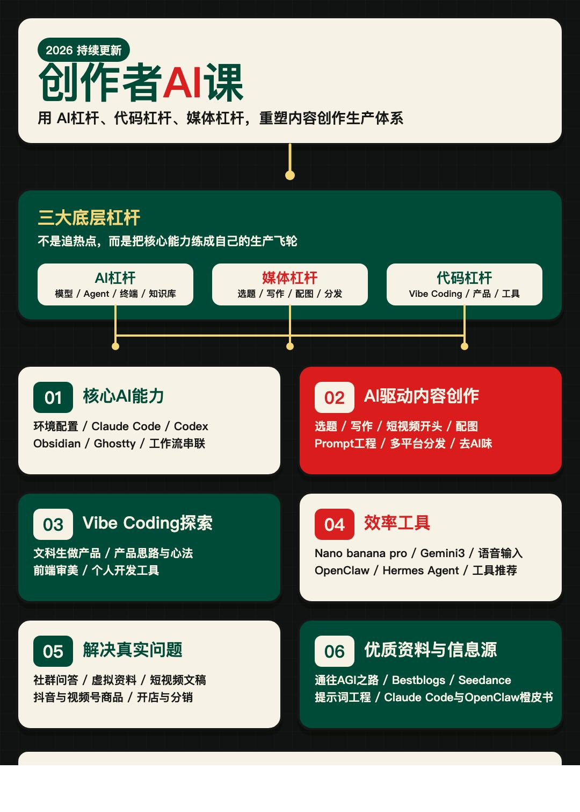

# Jacky-Illustration

> 中文内容配图与信息可视化生图 Skill 仓库。

Jacky-Illustration 是一个面向内容创作者的生图 Skill 集合，覆盖两类需求：

1. **信息可视化配图**：文章配图、知识科普、黑板报、Excalidraw 架构图、可爱漫画信息图。
2. **IP 型正文配图**：小黑 / Jacky 小芽哥这类固定视觉角色，把文章里的关键认知动作画成有识别度的正文插图。

兼容说明：统一入口目录使用 `jacky-illustration/`，保留小写 skill name，避免影响已经按旧名称安装的用户。

## 付费知识库与答疑群

<a href="https://mp.weixin.qq.com/s/x924y3O9-nWda5OTHArKKg">
  
</a>

我的付费知识库与答疑群欢迎加入：
[https://mp.weixin.qq.com/s/x924y3O9-nWda5OTHArKKg](https://mp.weixin.qq.com/s/x924y3O9-nWda5OTHArKKg)

期待与你的深度链接，一起用AI赋能，创作生财📈

## 当前可用 Skill

### 统一入口

```text
jacky-illustration/
```

优先安装这个目录。它会让用户先选择风格：

| 风格 | 适合场景 |
| --- | --- |
| 信息洞察可视化（涂鸦手绘风） | AI 自媒体、知识科普、PPT 演示感 |
| 黑板报风格 | 教学、怀旧学术、头脑风暴 |
| 可爱漫画信息可视化 | 萌系科普、轻松教学、社交媒体传播 |
| Excalidraw 白板架构风格 | 技术架构、系统设计、流程梳理 |
| IP 型正文配图 | 小黑 / Jacky 小芽哥正文插图 |

### IP 型子 Skill

```text
jacky-growth-illustrations/
ian-xiaohei-illustrations/
```

这两个目录保留为独立可用的 IP 型配图 skill：

- `jacky-growth-illustrations/`：Jacky 小芽哥，白色豆豆体型、头顶嫩芽、知识工位气质。
- `ian-xiaohei-illustrations/`：原始小黑版本，黑色小人、白底黑线、怪诞正文配图。

## 安装

从仓库根目录复制统一入口 skill：

```bash
mkdir -p "${CODEX_HOME:-$HOME/.codex}/skills"
cp -R ./jacky-illustration "${CODEX_HOME:-$HOME/.codex}/skills/"
```

如果你只想使用 IP 型正文配图，也可以单独复制：

```bash
cp -R ./jacky-growth-illustrations "${CODEX_HOME:-$HOME/.codex}/skills/"
cp -R ./ian-xiaohei-illustrations "${CODEX_HOME:-$HOME/.codex}/skills/"
```

## 使用示例

### 统一入口

```text
Use $jacky-illustration 为这篇中文文章设计配图。
先让我选择风格；如果我选 IP 型正文配图，再让我选择小黑或 Jacky 小芽哥。

<粘贴文章>
```

### 信息可视化

```text
Use $jacky-illustration 把这段内容做成信息洞察可视化配图。
要求：结构清晰、中文标注少而准、适合公众号和小红书文章中插图。
```

### IP 型正文配图

```text
Use $jacky-illustration 选择 Jacky 小芽哥 IP 型正文配图，为这篇文章生成 5 张 shot list。
先不要生图，只输出每张图放在哪段后、画什么、角色做什么、中文标注词。
```

## 目录结构

```text
.
├── README.md
├── LICENSE
├── NOTICE.md
├── jacky-illustration/          # 统一入口：四种信息可视化 + IP 型正文配图
├── jacky-growth-illustrations/  # Jacky 小芽哥 IP 型正文配图
├── ian-xiaohei-illustrations/   # 原始小黑 IP 型正文配图
└── examples/
```

## 注意事项

- 图片里的中文文字越短越稳定。
- 每张图只讲一个核心结构，不要把文章做成说明书。
- IP 型配图必须让角色承担核心动作；如果去掉角色画面仍然成立，说明角色太装饰。
- 信息图模式要优先保证结构清晰，不要为了好看牺牲可读性。
- AI 图像模型可能出现错字、幻觉标签、风格漂移或多余标题，生成后需要检查。

## 来源与许可

本仓库保留 [Ian Xiaohei Illustrations](https://github.com/helloianneo/ian-xiaohei-illustrations) 来源对照，并合并 Jacky-OPC 中原 `jacky-illustration` 的信息可视化生图能力。License 见 [LICENSE](LICENSE)。
